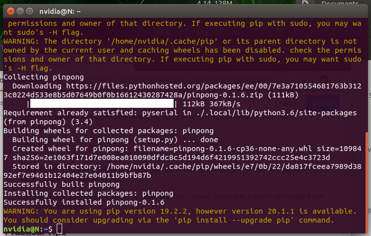
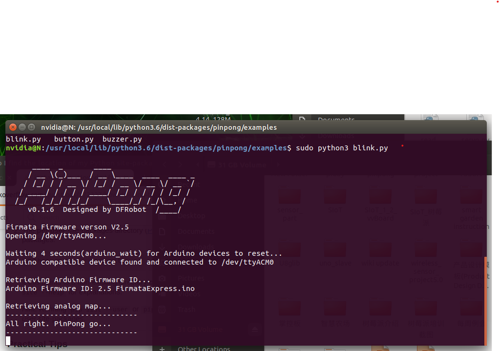

==================
Linux 平台安装
==================

终端中输入sudo pip install pinpong即可安装。  

.. code-block:: bash

        $ sudo pip install pinpong

帮助命令。在小黑窗中输入pinpong ，即可输出当前版本信息、官方文档网址、库列表查看、端口号。

开始第一个程序
-----------------

#. 连接arudino uno板至电脑；
#. 从本文档“PINPONG示例”复制“blink”示例程序的代码到Python编辑器中，运行代码；
#. 接下来请查看其他教程或运行其他示例程序进一步学习吧。

