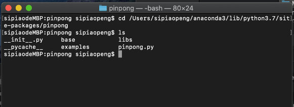

==================
Mac OS X 平台安装
==================

   

启动用命令行，（打开任意finder窗口，键入Shift+Command+U）, 双击“终端”。
输入命令行，安装pinPong库

.. code-block:: bash

        $ pip install pinpong

.. image::  images/2.png

开始第一个程序
-----------------

#. 连接arudino uno板至电脑；
#. 从本文档“PINPONG示例”复制“blink”示例程序的代码到Python编辑器中，运行代码；
#. 接下来请查看其他教程或运行其他示例程序进一步学习吧。

.. code-block:: bash

    $ python blink.py

