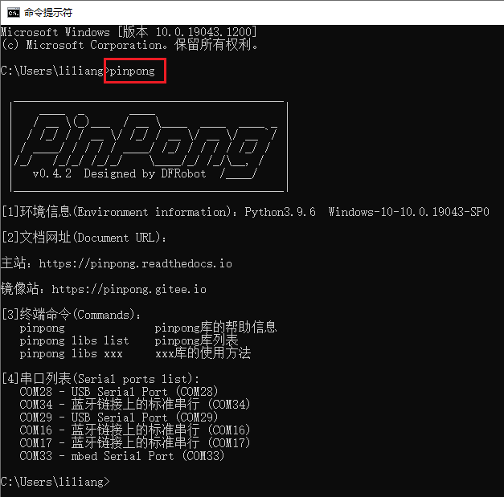

=================
查看pinpong版本
=================
pinpong安装成功后，在小黑窗中输入pinpong ，即可输出当前版本信息、官方文档网址、库列表查看、端口号。

==============
升级pinpong库
==============

pinpong目前处于快速更新迭代中，因此会不定期进行更新，通过如下命令可以进行版本更新：

.. code-block:: bash

        $ pip install -U pinpong 

.. 注意:: 如果网络较慢安装不成功，可以指定国内源进行安装： pip install -U pinpong -i http://mirrors.aliyun.com/pypi/simple/

==============
卸载pinpong库
==============
如果pinpong库出现异常情况时，可以尝试使用如下命令卸载pinpong库然后再使用install命令安装：

.. code-block:: bash

        $ pip uninstall pinpong 

