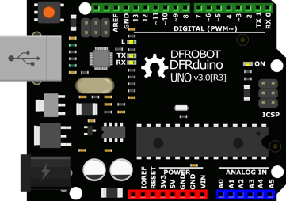
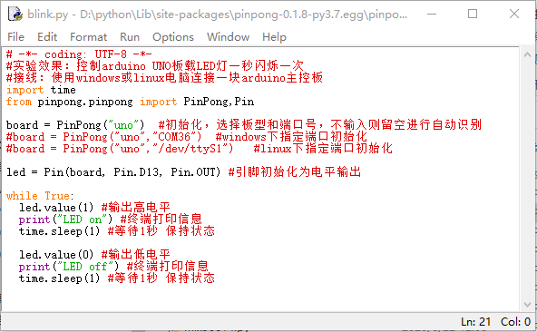
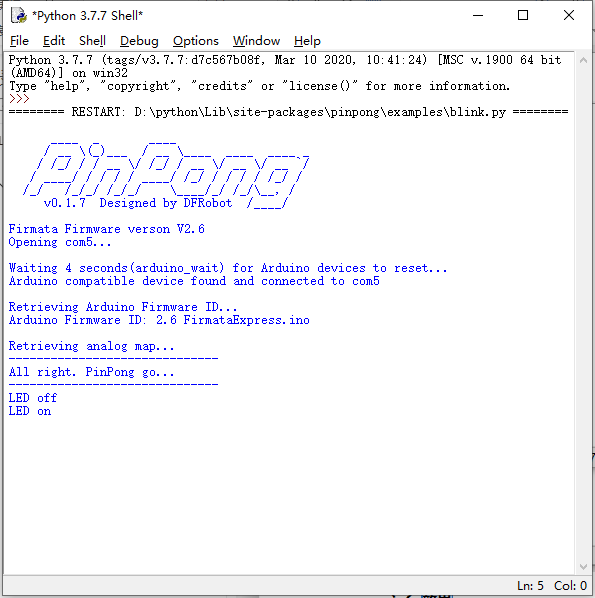
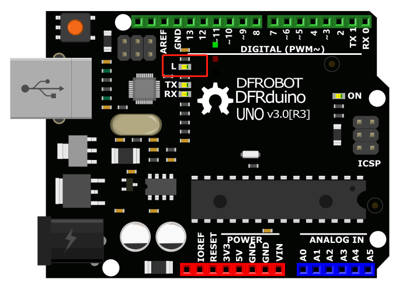
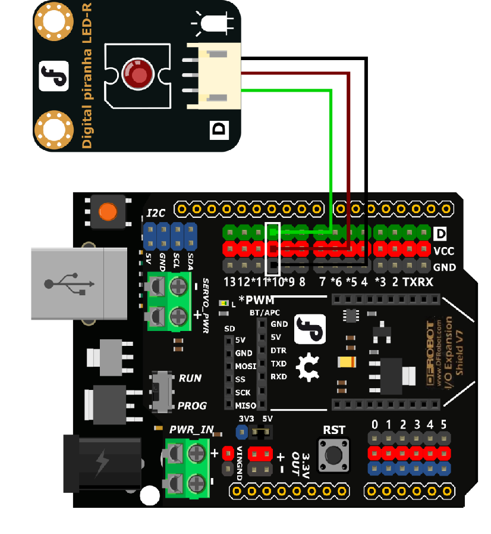
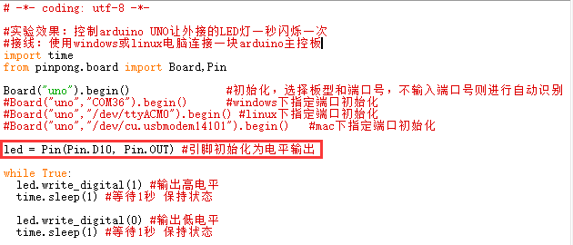

===============
项目1  LED闪烁
===============

----------------
一、概述
----------------

Hello World是所有编程语言学习的第一课，但是在Arduino学习中，我们的Hello World叫做Blink。Blink是什么意思呢？闪烁。其实Blink就是点亮Arduino机上的板载LED灯，并让它闪烁的一个程序。

----------------
二、项目实施
----------------

（1）点亮板载LED灯
-------------------

**硬件准备：**

主控：Arduino UNO

连接线：TypeAtoB方口USB连接线

**软件准备：**

本教程项目使用操作系统为Win10，Python版本为3.8.5，编译器使用Python自带IDLE编辑器，Arduino板使用pinpong库驱动。

1、打开pinpong官方文档，找到基础库示例中的“blink”，并用IDLE打开。

2、 blink.py示例程序，右键选择Edit with IDLE→Edit with IDLE3.8.5 即可使用IDLE打开Python程序编辑内容。

**程序编写：**

将Arduino Uno主板通过USB连接到电脑后，无需选择端口，在运行程序时会自动识别端口，如识别失败则可以采用“指定端口初始化”的形式手动指定COM口。

注：第一次使用pinpong库会自动给Arduino主板烧录Firmata固件。所以不需要专门给Arduino上传固件。

按下F5运行程序，会提示保存程序，点击确定保存即可。运行成功后会弹出一个新的窗口，等待程序运行如图所示即为成功。

查看效果。Arduino Uno上的板载LED会按照亮1秒，熄灭1秒的规律闪烁。（如果此步执行没有成功可以查看官方文档中的常见问题）

注意：在程序运行时不可以拔掉与Arduino连接的USB线，且不能关闭新弹出的运行窗口，如果拔线或者关闭运行窗口，程序功能就会停止执行。

**运行效果**

红圈中的LED灯会按照亮1秒，熄灭1秒的规律闪烁。

1、如果我们想要修改小灯闪烁的频率，应该怎么修改程序？只需要修改代码中延时部分的时长即可。如图所示修改后的效果为小灯点亮2秒，熄灭1秒。

.. code-block:: python

  #实验效果：控制arduino UNO板载LED灯一秒闪烁一次
  #接线：使用windows或linux电脑连接一块arduino主控板
  import time
  from pinpong.board import Board,Pin
  Board("uno").begin()               #初始化，选择板型和端口号，不输入端口号则进行自动识别
  #Board("uno","COM36").begin()      #windows下指定端口初始化
  #Board("uno","/dev/ttyACM0").begin() #linux下指定端口初始化
  #Board("uno","/dev/cu.usbmodem14101").begin()   #mac下指定端口初始化
  led = Pin(Pin.D13, Pin.OUT) #引脚初始化为电平输出
  while True:
    led.write_digital(1) #输出高电平
    time.sleep(2) #等待2秒 保持状态
    led.write_digital(0) #输出低电平
    time.sleep(1) #等待1秒 保持状态

（2）点亮外接LED灯
--------------------

**硬件准备：**

主控：Arduino UNO、IO 传感器扩展板 V7.1

模块：LED发光模块

连接线：TypeAtoB方口USB连接线

硬件连接图：

- 将扩展板接入Arduino Uno主控板上，组装时注意对准后在压入，以防压弯插针。

- 将LED模块接入10号数字引脚。

**程序编写：**

1、我们在接线的时候将外接LED接到了10号引脚，所以我们需要修改程序才可以点亮这颗外接的小灯，将led 对应的引脚修改为10。

2、如果想要小灯有一个呼吸灯的效果应该如何执行？找到示例程序中的PWM模拟输出功能，并用Python IDLE运行。

3、修改引脚号与端口号，然后运行程序，小灯就会循环执行LED灯渐渐变亮，到最亮时熄灭的命令。

.. code-block:: python

    示例程序
    # -*- coding: utf-8 -*-
    #实验效果：小灯会循环执行渐渐变亮，到最亮时熄灭的命令
    #接线：使用windows或linux电脑连接一块arduino主控板，主控板D6接一个LED灯模块
    import time
    from pinpong.board import Board,Pin,PWM #导入PWM类实现模拟输出

    Board("uno").begin()  #初始化，选择板型和端口号，不输入端口号则进行自动识别
    #Board("uno","COM36").begin()  #windows下指定端口初始化
    #Board("uno","/dev/ttyACM0").begin()   #linux下指定端口初始化
    #Board("uno","/dev/cu.usbmodem14101").begin()   #mac下指定端口初始化

    pwm0 = PWM(Pin(Pin.D6)) #将Pin传入PWM中实现模拟输出

    while True:
    for i in range(255): #从0到255循环
        pwm0.duty(i)  #设置模拟输出值
        print(i)
        time.sleep(0.05)

----------------
三、代码分析
----------------

数字信号与模拟信号

你知道什么是数字信号什么是模拟信号吗？让我们先看看数字信号与模拟信号的概念吧。

资料阅读：

    数字信号：数字信号指自变量是离散的、因变量也是离散的信号，这种信号的自变量用整数表示，因变量用有限数字中的一个数字来表示。在计算机中，数字信号的大小常用有限位的二进制数表示。

    .. image::  images/digitalpic.png

    模拟信号：模拟信号是指用连续变化的物理量表示的信息，其信号的幅度，或频率，或相位随时间作连续变化，或在一段连续的时间间隔内，其代表信息的特征量可以在任意瞬间呈现为任意数值的信号。

    .. image::  images/analogpic.png

光看概念感觉特别抽象，那么我们用生活中的实例来理解，比如我们平时用到的用于开关灯的开关，开和关是两个状态，非开即关。那么对灯来说开和关就是数字信号。再想想家中如果有一个温度计的话，温度变化是一个连续变化的的数值，并不能用某个特殊的状态来表示，温度的变化就是模拟信号。

在理解了数字信号与模拟信号之后，思考一下，在本项目中控制LED灯亮灭的信号是数字信号还是模拟信号？

----------------
四、硬件分析
----------------

不知道同学们有没有注意到，我们在第二个呼吸灯案例的时候，LED灯是接在10号数字引脚上的，但是按照数字信号和模拟信号的概念来看，应该是模拟信号才能实现呼吸灯的效果。这里就需要我们了解一个新的知识点，PWM信号。

观察我们手中的Arduino UNO主控板的数字引脚上，是不是有些引脚号旁边有*标记（有些板子是波浪号~）这些引脚就是支持PWM信号输出的引脚。

PWM（Pulse width modulation，中文名脉冲宽度调制），脉冲宽度调制是一种模拟控制方式。在Arduino中pwm是不断的做高低电平切换模拟出一种近似模拟量的输出的效果来实现变化的。但是这里仅仅得到了近似模拟值输出的效果，如果要输出真正的模拟值，还需要在模拟引脚上执行。
