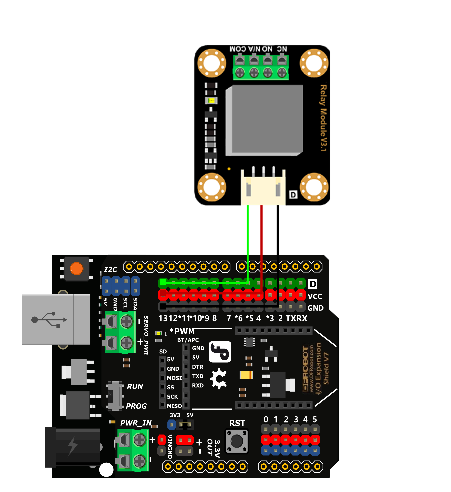
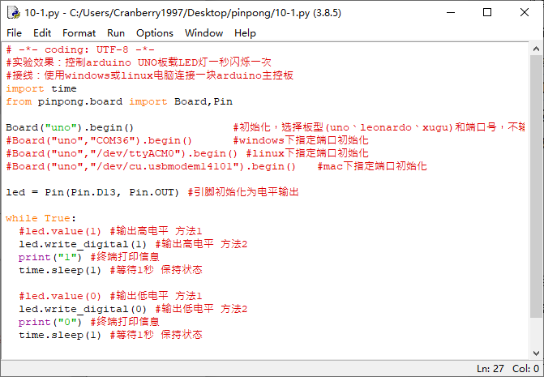
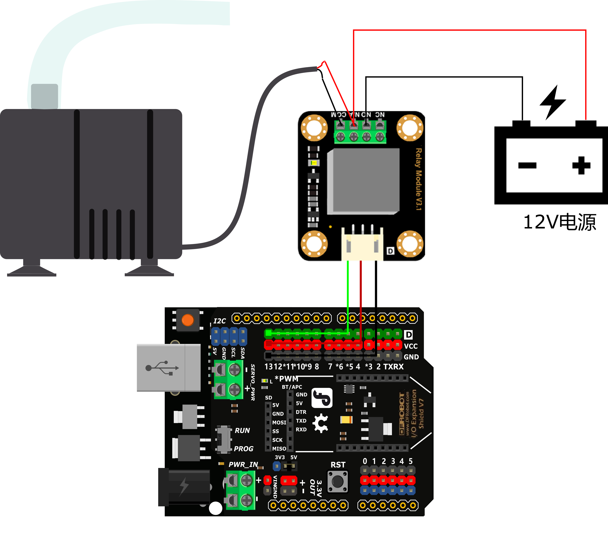
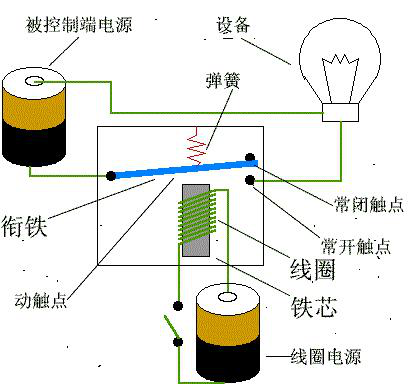
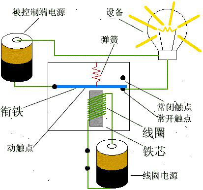

项目10 定时浇花装置
=====================

----------------
一、概述
----------------

相信大家的家中应该都会养有一些植物吧，想要植物生长的旺盛我们就需要定期给他们浇水，但是我们可能常常会忘记给家中的植物浇水，可能就会导致植株枯萎，为了避免出现这类问题，我们可以自己设计一个定时浇花装置。


----------------
二、项目实施
----------------

（1）驱动继电器
--------------------

`````````````
硬件准备：  
`````````````

主控：Arduino UNO、IO 传感器扩展板 V7.1

模块：继电器模块

连接线：TypeAtoB方口USB连接线




* 将继电器接入13号数字接口


````````````
程序编写：
````````````

1、继电器是通过高低电平来控制开关的，所以我们可以参考blink.py。运行这段程序会出现的效果是继电器随着L灯的闪烁会有“啪嗒”声，这就是继电器内的电磁开关在切换时发出的声音。




（2）用继电器控制水泵
--------------------------

要实现浇花的功能那么就会需要使用到水泵来帮我们实现，但是水泵的工作电压大多是12V的，但是我们使用的arduino uno的输出电压是5v，无法直接驱动水泵，这时我们就需要借助继电器来驱动水泵了.


`````````````
硬件准备：  
`````````````

主控：Arduino UNO、IO 传感器扩展板 V7.1

模块：继电器模块、水泵、12V电源

连接线：TypeAtoB方口USB连接线





* 将继电器接入13号数字接口

* 水泵与继电器连接


````````````
程序编写：
````````````

1、浇花需要每隔一定的时间再执行，那如何控制间隔时间呢？用之前项目中最常用的 time.sleep（） 行不行？

用延时功能来控制是可以实现功能的，但是无法精确的定位在指定的时间，限制非常多，每次重启程序延时的时间就会重新计算，影响浇水的效率。


2、这里我们将使用time函数的time.strftime()功能来定位时间，如示例中，在每天下午15点30分10秒的时候打印“浇花”。在实际使用中将继电器执行功能加进来就可以了。

.. code-block:: python


 import time
 while True:
   time_now = time.strftime("%H:%M:%S", time.localtime()) # 刷新
   if time_now == "15:30:00": #此处设置每天定时的时间
     print("浇花")
     time.sleep(1) 


3、加入继电器实现每天定时浇水功能。

.. code-block:: python

 import time
 from pinpong.pinpong import PinPong,Pin

 board = PinPong("uno")  #初始化，选择板型和端口号，不输入则留空进行自动识别

 led = Pin(board, Pin.D13, Pin.OUT) #引脚初始化为电平输出

 while True:
   time_set = time.strftime("%H:%M:%S",time.localtime()) #刷新
   if time_set == "10:00:00":  #设定为每天早上十点钟浇水
    led.value(1) #输出高电平
    print("浇花") #终端打印信息
    time.sleep(5) #等待5秒 保持状态
   else:
    led.value(0) #输出低电平
    time.sleep(1) #等待1秒 保持状态

----------------
三、代码分析
----------------

.. code-block:: python

 import time
 from pinpong.pinpong import PinPong,Pin

 board = PinPong("uno")  #初始化，选择板型和端口号，不输入则留空进行自动识别

 led = Pin(board, Pin.D13, Pin.OUT) #引脚初始化为电平输出

 while True:
   time_set = time.strftime("%H:%M:%S",time.localtime()) #刷新
   if time_set == "10:00:00":  #设定为每天早上十点钟浇水
    led.value(1) #输出高电平
    print("浇花") #终端打印信息
    time.sleep(5) #等待5秒 保持状态
   else:
    led.value(0) #输出低电平
    time.sleep(1) #等待1秒 保持状态

time库函数

time库在我们之前的案例中一直有使用到的一个库，但是我们大多数情况只用到了其中的延时的功能，其实还有很多功能，让我们来了解一下吧。

time库是python中处理时间的标准库

1、time库的使用

* 时间获取-------time() ctime()  gmtime()

* 时间格式化-------strftime()  strptime()

* 程序计时-------sleep()  perf_counter()

2、时间获取函数

* time()-------获取当前时间戳，浮点数形式

* ctime()-------以可读的方式返回字符串时间

* gmtime()-------计算机可以处理的时间格式

3、时间格式化

* strftime()-------将时间进行合理输出

* strptime()-------自定义时间

4、程序计时

* perf_counter()-------测量时间函数

* sleep()-------产生时间函数,模拟休眠的时间，单位是秒，可以是浮点数


----------------
四、硬件分析
----------------


继电器

继电器（英文名称：relay）是一种电控制器件，是当输入量（激励量）的变化达到规定要求时，在电气输出电路中使被控量发生预定的阶跃变化的一种电器。它具有控制系统（又称输入回路）和被控制系统（又称输出回路）之间的互动关系。通常应用于自动化的控制电路中，它实际上是用小电流去控制大电流运作的一种“自动开关”。故在电路中起着自动调节、安全保护、转换电路等作用。

光看文字描述有点难以理解，下面看看图示帮助理解继电器的作用。继电器工作原理图：



这里有两个电源回路，一个是线圈部分的回路另一个是设备（灯珠）端的回路。我们把线圈铁芯这端理解成掌控板这端，设备（灯珠）端我们理解成水泵；线圈电源就是掌控板的输出电压5V，被控制端电源电压就是我们驱动水泵的12V电源。我们通过5V的电压控制线圈铁芯这个电磁铁，当继电器高电平时，线圈通电，将衔铁吸引，这样设备端的回路就接通了。



继电器的作用

继电器是具有隔离功能的自动开关元件，广泛应用于遥控、遥测、通讯、自动控制、机电一体化及电力电子设备中，是最重要的控制元件之一。

继电器一般都有能反映一定输入变量（如电流、电压、功率、阻抗、频率、温度、压力、速度、光等）的感应机构（输入部分）；有能对被控电路实现“通”、“断”控制的执行机构（输出部分）；在继电器的输入部分和输出部分之间，还有对输入量进行耦合隔离，功能处理和对输出部分进行驱动的中间机构（驱动部分）。

作为控制元件，概括起来，继电器有如下几种作用：

1）扩大控制范围：例如，多触点继电器控制信号达到某一定值时，可以按触点组的不同形式，同时换接、开断、接通多路电路。

2）放大：例如，灵敏型继电器、中间继电器等，用一个很微小的控制量，可以控制很大功率的电路。

3）综合信号：例如，当多个控制信号按规定的形式输入多绕组继电器时，经过比较综合，达到预定的控制效果。

4）自动、遥控、监测：例如，自动装置上的继电器与其他电器一起，可以组成程序控制线路，从而实现自动化运行。
