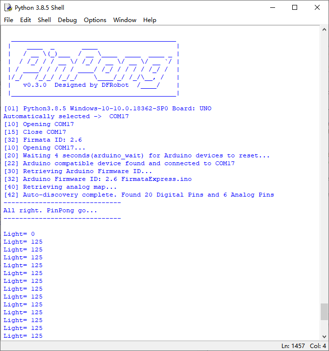
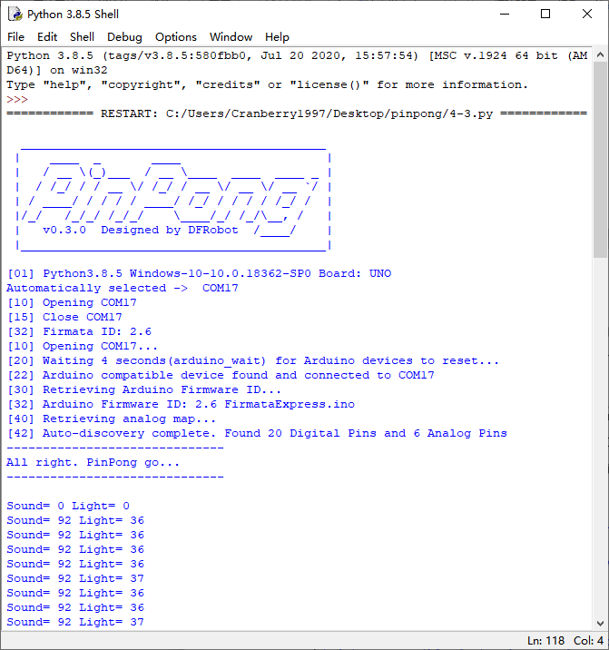

项目4 智能节能灯
==================

----------------
一、概述
----------------

在前面的章节我们学习了如何点亮小灯，如何调节亮度等等功能，那像楼道灯那样的，只会在黑夜且发出声音才会亮起的灯是如何实现的呢？我们将在本项目中学习。


----------------
二、项目实施
----------------

（1）通过光线亮度控制小灯
-------------------------

`````````````
硬件准备：  
`````````````

主控：Arduino UNO、IO 传感器扩展板 V7.1

模块：LED发光模块、光线传感器

连接线：TypeAtoB方口USB连接线

.. image::  images/04LDL1.png

* 将LED模块接入D13引脚,光线传感器接入A2引脚

````````````
程序编写：
````````````

1、在示例程序中找到adc.py，并用IDLE打开，并修改端口号，或删去端口号，使用自动识别。

.. image::  images/0411.png

2、修改代码，当亮度低于100的时候，点亮LED灯。

.. code-block:: python


 import sys
 import time
 from pinpong.pinpong import *

 board = PinPong("uno","com5")
 board.connect()
 light = ADC(board, Pin(board, Pin.A2))
 d13 = Pin(board, Pin.D13, Pin.OUT)

 while True:
   vl = light.read()
   print("Light=", vl)
   if vl < 100 :
     d13.value(1)
   else :
     d13.value(0)


3、摁下F5运行程序，查看效果。当遮住光线传感器的时候LED灯会亮起，恢复后LED灯会熄灭。




注意：在程序运行时不可以拔掉与Arduino连接的USB线，且不能关闭新弹出的Python shell运行窗口，如果拔线或者关闭运行窗口，程序功能就会停止执行。


（2）加入声音传感器检测
------------------------

`````````````
硬件准备：
`````````````

主控：Arduino UNO、IO 传感器扩展板 V7.1

模块：LED发光模块、光线传感器、声音传感器

连接线：TypeAtoB方口USB连接线


硬件连接图：

.. image::  images/04LDL2.png


* 将LED模块接入D13引脚，光线传感器接到A2引脚，声音传感器接到A1引脚。


````````````
程序编写：
````````````

1、设计程序逻辑图

.. image::  images/04log.png

2、导入必要的包和初始化设置。

.. code-block:: python


 import sys
 import time
 from pinpong.pinpong import *

 board = PinPong("uno","com5")
 board.connect()

 sound = ADC(board, Pin(board, Pin.A1))
 light = ADC(board, Pin(board, Pin.A2))
 d13 = Pin(board, Pin.D13, Pin.OUT)


3、加入逻辑判断部分。

.. code-block:: python

 while True:
   vs = sound.read()
   vl = light.read()
   print("Sound=",vs,"Light=", vl)
   if vs > 200 and vl < 100 :
     d13.value(1)
     time.sleep(3)
   else :
     d13.value(0)

4、运行代码，当遮住光线传感器且发出声音时，LED灯会亮3秒然后熄灭。



----------------
三、代码分析
----------------

.. code-block:: python

 import sys
 import time
 from pinpong.pinpong import *  #导入必要的库函数
 
 board = PinPong("uno","com5")  #初始化设置Aduino
 board.connect()                #连接Arduino，并检测固件

 sound = ADC(board, Pin(board, Pin.A1))  #初始化模拟引脚A1，检测声音大小
 light = ADC(board, Pin(board, Pin.A2))  #初始化模拟引脚A2，检测光线强度
 d13 = Pin(board, Pin.D13, Pin.OUT)    #初始化13号数字引脚

 while True:
   vs = sound.read()   
   vl = light.read()
   print("Sound=",vs,"Light=", vl)  #打印声音和光线数据
   if vs > 200 and vl < 100 :      #判断光线和声音大小
     d13.value(1)
     time.sleep(3)
   else :
     d13.value(0)


如何进行多条件判断

在本项目中我们需要判断两个条件，在我们做逻辑判断的时候经常会需要进行多条件判断，有些时候是需要两个条件都要满足的，有些时候是两个条件满足任意一条就可以了。在这种情况下，我们应该如何编写程序呢？

两条条件都需要满足的情况下，我们可以这样写

.. code-block:: python

 if 条件A and 条件B

两条条件满足任一即可的情况下，我们可以这样写

.. code-block:: python

 if 条件A or 条件B

想要得到反向的结果，即当x为true，得到的结果为false，当x为false时，得到的结果为true，我们可以这样写

.. code-block:: python

 not 条件


----------------
四、硬件分析
----------------

在项目中我们用到了两种传感器，光线传感器和声音传感器

光线传感器是将光信号变成电信号的特殊电子元件，在光线传感器中起到主要作用的就是就是光敏二极管。光敏二极管是光敏电阻中的一种。光明电阻在黑暗环境中，具有非常高阻值的电阻。光线越强，电阻值反而越低。随着两端电阻值的减小，电压也就相应减小，所以从模拟口独到的值也就变小。我们读取的数据也是由此而来的。


声音传感器的作用相当于一个麦克风。它用来接收声波，反馈声音的振动图像。在声音传感器上起到主要作用的就是麦克风，声波使麦克风内的薄膜震动，导致内部电容的变化，而产生与之对应的电压变化，经过转换为可监测的电压值反馈而来。

.. image::  images/soundsen.png
