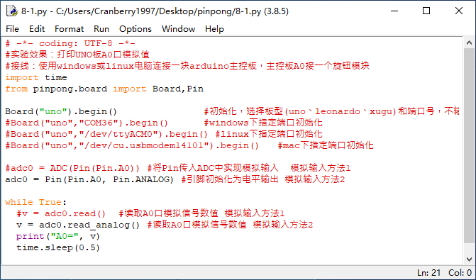

项目8 桌面气象站
==================

----------------
一、概述
----------------

在日常生活中，你是否会关注自己身处环境的温度？自己身处的环境是否过热或过冷？什么时候需要开空调了？如果你有这些疑问，就请跟着我们来完成一个桌面气象站吧。

.. image::  images/08th.png

----------------
二、项目实施
----------------

（1）读取温度传感器数据
------------------------

`````````````
硬件准备：  
`````````````

主控：Arduino UNO、IO 传感器扩展板 V7.1

模块：LM35线性温度传感器

连接线：TypeAtoB方口USB连接线


.. image::  images/0801L.png

* 将LM35线性温度传感器接入A0模拟接口


````````````
程序编写：
````````````

1、LM35温度传感器需要通过读取模拟值经过一定的换算得到温度数据，那么首先就需要读取对应引脚的模拟值，回顾之前案例，打开示例程序中的adc.py。




2、修改程序，添加转换公式：温度= 读取到模拟值 * (5/10.24);这样就能顺利读取温度数据了。

.. code-block:: python

 import time
 from pinpong.pinpong import PinPong,Pin,ADC

 uno = PinPong("uno")
 adc0 = ADC(uno,Pin(uno, Pin.A0))

 while True:
   v = adc0.read()
   tem = round(v*(5/10.24),2)
   print("temputer", tem)
   time.sleep(1)


（2）让屏幕显示温度数据
--------------------------

在上个项目中我们使用了LCD显示屏，为了方便查看温度的实时数据，我们将数据在屏幕上显示出来。


`````````````
硬件准备：  
`````````````

主控：Arduino UNO、IO 传感器扩展板 V7.1

模块：1602LCD显示屏、LM35线性温度传感器

连接线：TypeAtoB方口USB连接线


* 将1602LCD显示屏接入IIC接口

* 将LM35线性温度传感器接入A0模拟接口


````````````
程序编写：
````````````

1、导入必要库和模块，参考之前使用过的LCD屏所需的部分和adc部分。

.. code-block:: python

 import time
 from pinpong.pinpong import PinPong
 from pinpong.libs.lcd1602_i2c import LCD1602_I2C
 from pinpong.pinpong import PinPong,Pin,ADC


2、然后对需要用到的功能进行初始化设置。

.. code-block:: python

 uno = PinPong("uno")
 adc0 = ADC(uno,Pin(uno, Pin.A0))
 lcd = LCD1602_I2C(uno, 0x20)
 lcd.backlight(True)

 lcd.set_cursor(2,0)
 lcd.print('temperature')


3、让屏幕显示温度，每隔一秒钟刷新。

.. code-block:: python

 while True:
   v = adc0.read()
   tem = round(v*(5/10.24),2)
   lcd.set_cursor(5,1)
   lcd.print(str(tem))
   lcd.print('C')
   time.sleep(1)

----------------
三、代码分析
----------------

.. code-block:: python

 import time
 from pinpong.pinpong import PinPong
 from pinpong.libs.lcd1602_i2c import LCD1602_I2C
 from pinpong.pinpong import PinPong,Pin,ADC

 uno = PinPong("uno")  #初始化，选择板型和端口号，不输入则留空进行自动识别
 adc0 = ADC(uno,Pin(uno, Pin.A0)) #初始化模拟引脚
 lcd = LCD1602_I2C(uno, 0x20) #初始化LCD的I2C地址
 lcd.backlight(True)  #打开背光

 lcd.set_cursor(2,0)
 lcd.print('temperature') #在指定位置显示文本

 while True:
   v = adc0.read()
   tem = round(v*(5/10.24),2) #将读取到的数值转换为温度数据
   lcd.set_cursor(5,1)
   lcd.print(str(tem))
   lcd.print('C')
   time.sleep(1)


----------------
四、硬件分析
----------------

LM35线性温度传感器

基于LM35半导体的温度传感器，可以用来对环境温度进行定性的检测。LM35半导体温度传感器是美国国家半导体公司生产的线性温度传感器。其测温范围是-40℃到150℃，灵敏度为10mV/℃，输出电压与温度成正比。

.. image::  images/0830.png

