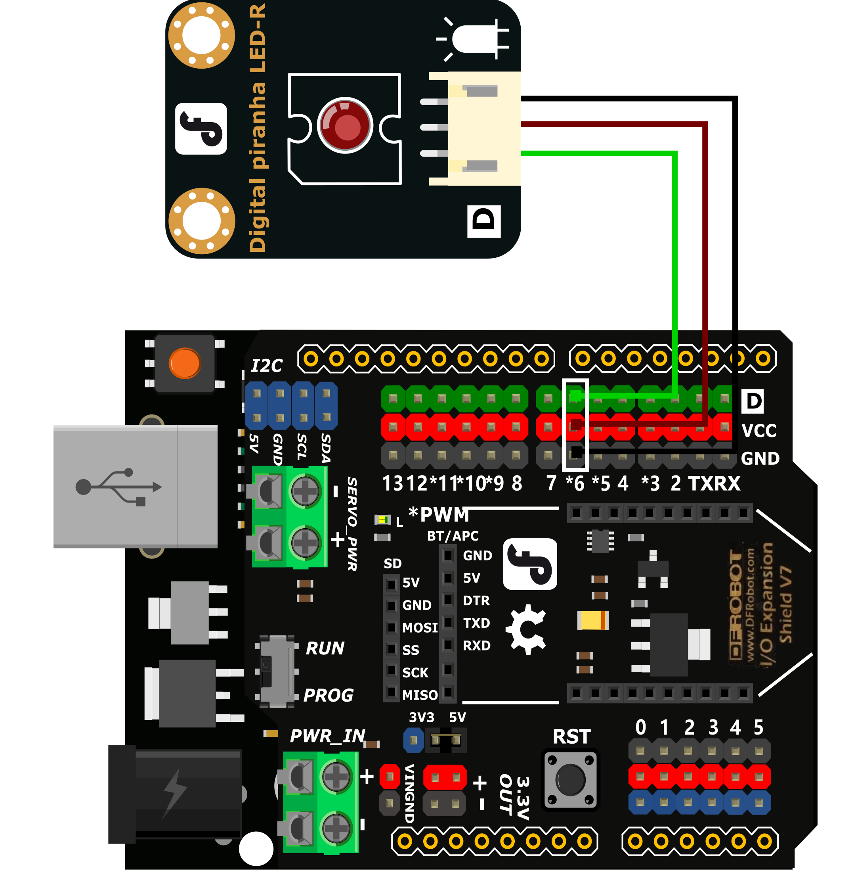
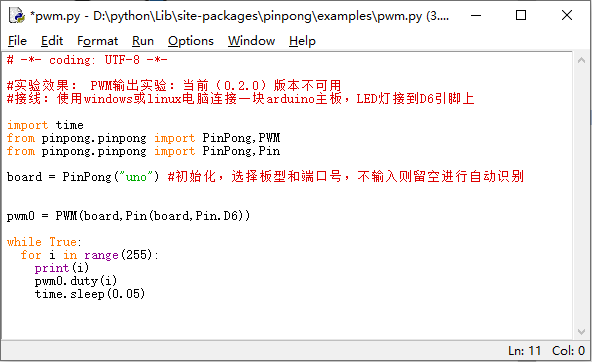
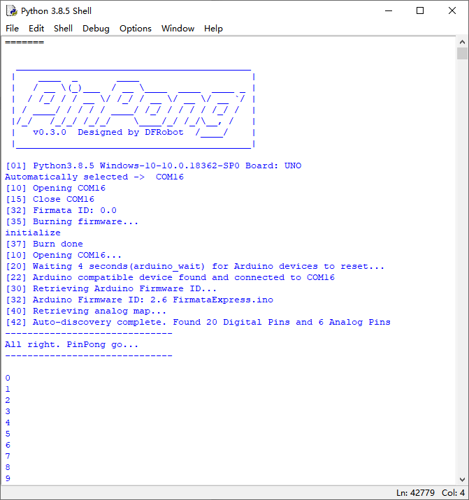
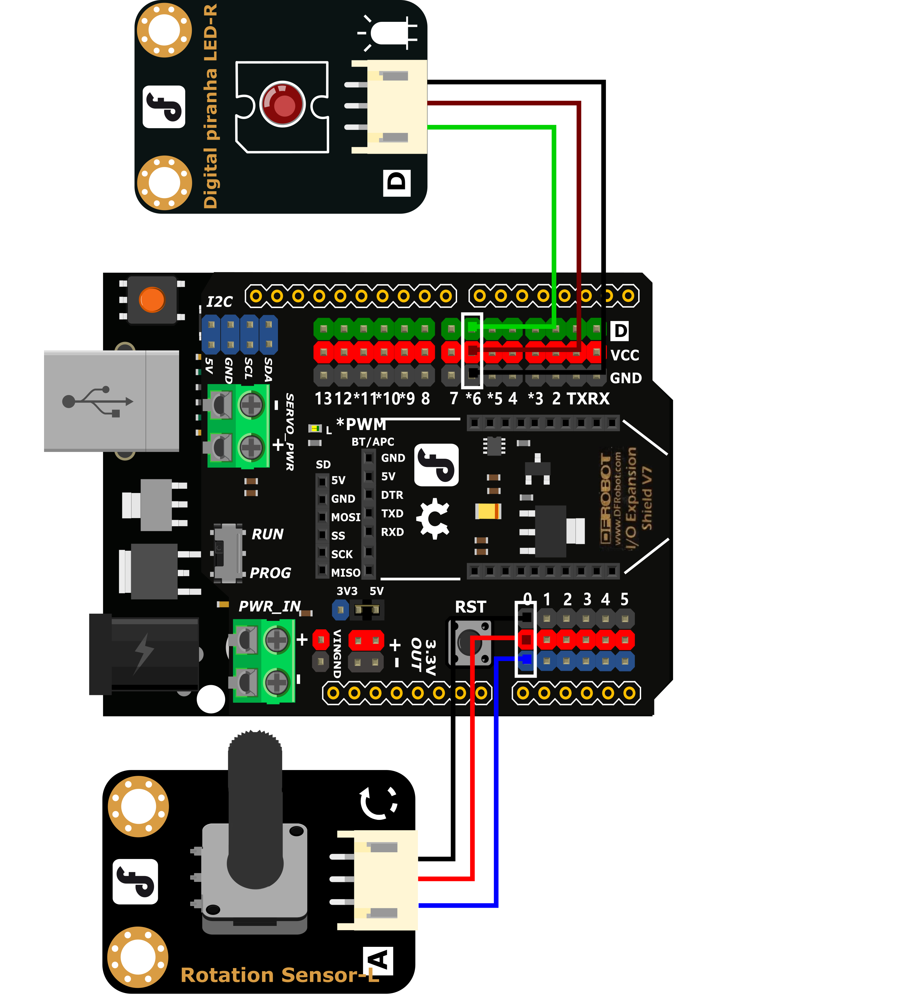
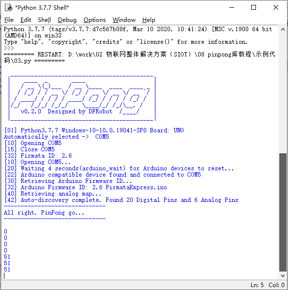
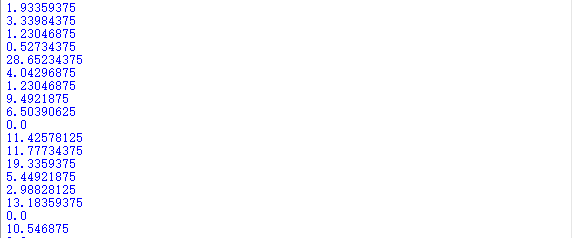

===============
项目3 调光台灯
===============

一、概述
========

在前面的课程中我们学会了如何点亮并控制LED灯，那LED灯的亮度我们可以调节吗？如果输出的值不是数字量，而是模拟量，是不是就可以实现通过数值来精确控制灯光亮度了。

在上节课的设计中，我们使用的是按钮控制灯的亮灭，按钮只有两个状态，是没办法输出模拟值的，所以本项目我们就需要使用到旋钮来作为灯光亮度的输入。

.. image::  images/3rd.png

二、项目实施
============

--------------
（1）渐变灯光
--------------

**硬件准备：**

主控：Arduino UNO、IO 传感器扩展板 V7.1

模块：LED发光模块

连接线：TypeAtoB方口USB连接线

- 将LED发光模块接入6号数字引脚

**程序编写：**

1. 打开pingpong库的官方文档，找到基础库示例中的“模拟输出”，并用IDLE打开。

2. 摁下F5运行程序，查看效果。LED灯会逐渐变亮，当到最亮时熄灭再慢慢变亮，循环变化。

--------------
（2）旋钮调光
--------------

在上步完成的功能中,我们旋钮来精确的控制LED灯的亮度。

**硬件准备：**

主控：Arduino UNO、IO 传感器扩展板 V7.1

模块：LED发光模块、旋钮模块

连接线：TypeAtoB方口USB连接线

- 将LED发光模块接入6号数字引脚，将旋钮模块接入A0模拟引脚

**程序编写：**

1. 导入必要的包和初始化设置。

.. code-block:: python

    import time
    from pinpong.board import Board,Pin
    Board("uno").begin() #初始化，选择板型和端口号，不输入则留空进行自动识别
    pwm0 = Pin(Pin.D6, Pin.PWM)
    adc0 = Pin(Pin.A0, Pin.ANALOG) #将Pin传入ADC中实现模拟输入

2. 我们需要将旋钮输出的模拟值转换为LED灯亮度的PWM值，为了得到整数这里用了整型功能int。

.. code-block:: python

    v = adc0.read_analog() #读取A0口模拟信号数值
    L = int(v*255/1024)

3. 接着让LED灯根据我们转换过的数值亮起。

.. code-block:: python

    pwm0.write_analog(L) #PWM输出
    print("A0=",L)

4. 运行代码，旋转旋钮LED灯会慢慢亮起和熄灭。

三、代码分析
============

.. code-block:: python

    import time
    from pinpong.board import Board,Pin

    Board("uno").begin()               #初始化，选择板型(uno、leonardo、xugu)和端口号，不输入端口号则进行自动识别

    pwm0 = Pin(Pin.D6, Pin.PWM) #初始化引脚为PWM模式 模拟输出方法2
    adc0 = Pin(Pin.A0, Pin.ANALOG) #引脚初始化为电平输出

    while True:
        v = adc0.read_analog() #读取A0口模拟信号数值
        L = int(v*255/1024)
        pwm0.write_analog(L) #PWM输出
        print("A0=",L)

**数据类型-整数类型**

在我们做运算的时候，传感器读取到的数值经过*180/1024运算的结果往往不会是一个整数，常常会带着长长的小数尾数。我们试着不加int整形得到的结果如下：

这样的数值我们是无法直接使用的，所以就需要使用到整形int将数据取整。