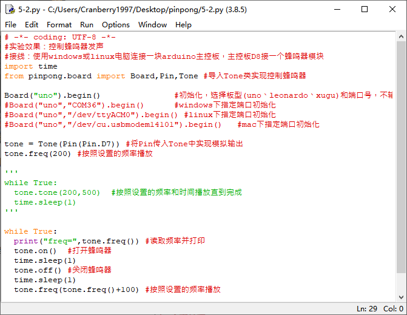

===================
项目5 近视警示器
===================

一、概述
==========

近视眼越来越多，抛开遗传因素，主要还是不良用眼习惯导致的。特别是弓腰驼背，埋头看书，但是知道归知道，真的坐下本来挺直的腰杆又不知不觉地趴在桌子上。 

为了健康，为了保护视力，我们用蜂鸣器和超声波传感器做一个简易近视警示器。 

.. image::  images/5th.png

二、项目实施
============

----------------------
（1）使用超声波测距
----------------------

**硬件准备：**

主控：Arduino UNO、IO 传感器扩展板 V7.1

模块：超声波传感器

连接线：TypeAtoB方口USB连接线

.. image::  images/0501L.png

- 接线引脚TRIG--D7 、ECHO--D8、 GND--GND 、+5v--VCC 

**程序编写：**

1. 打开pingpong库的官方文档，找到常用库示例中的“超声波传感器”，并用IDLE打开。

2. 摁下F5运行程序，查看效果。在新弹出的窗口中会显示超声波传感器测得的距离。

.. image::  images/0512.png

----------------------
（2）使用蜂鸣器模块
----------------------

**硬件准备：**

主控：Arduino UNO、IO 传感器扩展板 V7.1

模块：蜂鸣器模块

连接线：TypeAtoB方口USB连接线

- 蜂鸣器模块连接到D7引脚

**程序编写：**

1. 打开pingpong库的官方文档，找到常用库示例中的“蜂鸣器”，并用IDLE打开，将程序中的D8改为D7。

2. 摁下F5运行程序，查看效果。在新弹出的窗口中会显示蜂鸣器的声音频率，蜂鸣器会按音阶递进响起。

.. image::  images/0522.png

----------------------
（3）完成近视警示器
----------------------

**硬件准备：**

主控：Arduino UNO、IO 传感器扩展板 V7.1

模块：蜂鸣器模块、超声波传感器

连接线：TypeAtoB方口USB连接线

- 接线引脚TRIG--D7 、ECHO--D8、 GND--GND 、+5v--VCC
- 将蜂鸣器模块接入D4引脚。

**程序编写**

.. code-block:: python

    import time
    from pinpong.board import Board,Pin,SR04_URM10,Tone#导入必要的库函数

    Board("uno").begin()#初始化，选择板型(uno、leonardo、xugu)和端口号，不输入端口号则进行自动识别

    tone = Tone(Pin(Pin.D4))#初始化蜂鸣器模块引脚为D4
    TRIGER_PIN = Pin(Pin.D7)#初始化超声波传感器TRIG引脚为D7
    ECHO_PIN = Pin(Pin.D8)#初始化超声波传感器ECHO引脚为D8

    tone.freq(200) #初始化蜂鸣器频率
    sonar = SR04_URM10(TRIGER_PIN,ECHO_PIN)#初始化超声波传感器

    while True:
        dis = sonar.distance_cm() #读取超声波传感器距离
        print("distance = %d cm"%dis)
        if dis < 50:
            tone.on()
            time.sleep(1)
        else:
            tone.off()

运行代码，当超声波传感器监测到距离小于50时，蜂鸣器会报警提示距离桌面太近。

三、代码分析
============

1. 设计程序逻辑图

2. 导入必要的包和初始化设置。

.. code-block:: python

    import time
    from pinpong.board import Board,Pin,SR04_URM10,Tone#导入必要的库函数

    Board("uno").begin()#初始化，选择板型(uno、leonardo、xugu)和端口号，不输入端口号则进行自动识别

    tone = Tone(Pin(Pin.D4))#初始化蜂鸣器模块引脚为D4
    TRIGER_PIN = Pin(Pin.D7)#初始化超声波传感器TRIG引脚为D7
    ECHO_PIN = Pin(Pin.D8)#初始化超声波传感器ECHO引脚为D8

    tone.freq(200) #初始化蜂鸣器频率
    sonar = SR04_URM10(TRIGER_PIN,ECHO_PIN)#初始化超声波传感器

3. 加入判断

.. code-block:: python

    while True:
        dis = sonar.distance_cm()#读取超声波传感器距离
        print("distance = %d cm"%dis)
        if dis < 50:
            tone.on()
            time.sleep(1)
        else:
            tone.off()

四、硬件分析
==============

1. 认识超声波传感器

目前主流的测距传感器有超声波测距传感器，红外线测距传感器，激光测距传感器和雷达传感器。其中，超声波传感器适用于大幅平面静止测距。普通超声波传感器测距范围约2cm~450cm。 

我们可以很清楚的看到实物超声波传感器上有 4 个角：VCC---5V 电源脚, Trig---出发控制端，Echo---接收端，GND---地段。图片中双探头传感器中，一个用来发送超声波，一个用来接收超声波。中间的单头超声波传感器即可以发送也可以接收超声波。这个传感器是我们接触的第一个四个引脚的传感器，使用的接线也比较特殊，后面的硬件连接需要做特殊处理。

超声波传感器测量距离的过程，超声波发射器向某一方向发射超声波，同时开始计时；超声波在空气中传播，一旦碰到障碍物立即折返；超声波接收器接收到反射波，同时停止计时。那么距离就可以通过时间差来计算出来。

.. image::  images/urm.jpg

2. 认识蜂鸣器

首先，我们对喇叭应该非常熟悉，常见的耳机就是两个小喇叭，还有收音机，MP3，PM4播放器，电视机音响的发生原件都是喇叭。喇叭也叫做扬声器，是电声转换期间，它可以把模拟电信号转换为声音信号，属于宽频率发声器件。 

而蜂鸣器是一体化的电子讯响器，可以在不同驱动波形下发出单调的声音，属于窄频率发声器件。我们可以通过改变频率设置蜂鸣器发声音高。

从外在表现看，喇叭和蜂鸣器最大区别是喇叭可以发出各种声音，而蜂鸣器只能发出几种单调的声音。从内在发声原理来看,蜂鸣器是利用压电陶瓷将电信号转化为机械振动信号；扬声器是利用电磁铁将电信号转化为机械振动信号。 

.. image::  images/buzzer.jpg