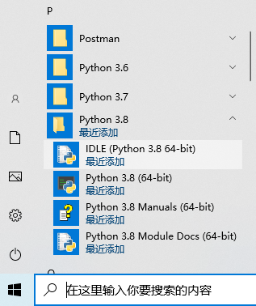
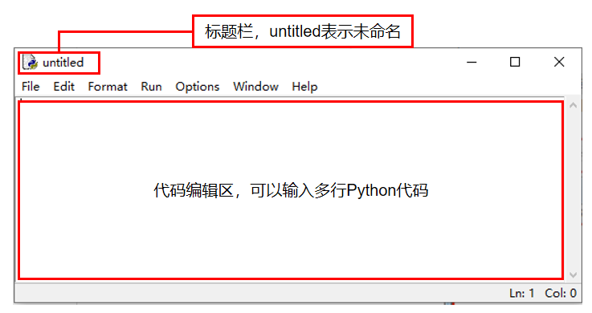

=============
项目前置知识
=============

----------------
概述
----------------

本系列教程是基于win10操作系统下，使用Python3通过pinpong库来控制Arduino UNO板来实现项目功能，在本节中我们将了解以下内容：

一、 什么是Arduino？

二、 什么是Python？

三、 如何编辑Python代码？

四、 什么是pinpong库？

--------------------
一、什么是Arduino？
--------------------

Arduino是一个开放源码电子原型平台，拥有灵活、易用的硬件和软件。Arduino专为设计师，工艺美术人员，业余 爱好者，以及对开发互动装置或互动式开发环境感兴趣的人而设的。

Arduino可以接收来自各种传感器的输入信号从而检测出运行环境，并通过控制光源，电机以及其他驱动器来影响 其周围环境。板上的微控制器编程使用Arduino编程语言（基于Wiring）和Arduino开发环境（以Processing为基 础）。Arduino可以独立运行，也可以与计算机上运行的软件（例如，Flash，Processing，MaxMSP）进行通信。Arduino开发 IDE 接口基于开放源代码，可以让您免费下载使用开发出更多令人惊艳的互动作品。

Arduino是人们连接各种任务的粘合剂。要给Arduino下一个最准确的定义，最好用一些实例来描述。

◆ 您想当咖啡煮好时，咖啡壶就发出“吱吱”声提醒您吗？ 

◆ 您想当邮箱有新邮件时，电话会发出警报通知您吗？ 

◆ 想要一件闪闪发光的绒毛玩具吗？ 

◆ 想要一款具备语音和酒水配送功能的X教授蒸汽朋克风格轮椅吗？ 

◆ 想要一套按下快捷键就可以进行实验测试蜂音器吗？ 

◆ 想为您的儿子自制一个《银河战士》手臂炮吗？ 

◆ 想自制一个心率监测器，将每次骑脚踏车的记录存进存储卡吗？ 

◆ 想过自制一个能在地面上绘图，能在雪中驰骋的机器人吗？

Arduino都可以为您实现。

1.1认识Arduino UNO
--------------------

Arduino系列有众多的型号，其中最为经典的就是Arduino UNO了。在后续项目中我们也将以Arduino UNO为主。

先来简单的看下Arduino UNO。下图中有标识的部分为常用部分。图中标出的数字口和模拟口，即为常说的I/O。数字口有0~13，模拟口有0~5。

除了最重要的I/O口外，还有电源部分。UNO可以通过两种方式供电方式，一种通过USB供电，另一种是通过外接 6~12V的DC电源。除此之外，还有4个LED灯和复位按键，稍微说下4个LED。ON是电源指示灯，通电就会亮了。L是接在数字口13上的一个LED，在下节的项目中会进行教学的。TX、RX是串口通讯指示灯，比如我们在下载程序的过程中，这两个灯就会不停闪烁。

.. image::  images/uno引脚.png

--------------------
二、什么是Python？
--------------------

Python是一种跨平台的计算机程序设计语言。是一个高层次的结合了解释性、编译性、互动性和面向对象的脚本语言。最初被设计用于编写自动化脚本(shell)，随着版本的不断更新和语言新功能的添加，越多被用于独立的、大型项目的开发。

Python是一种解释型脚本语言，可以应用于以下领域：
  
◆ Web 和 Internet开发

◆ 科学计算和统计

◆ 人工智能

◆ 桌面界面开发
 
◆ 软件开发

◆ 后端开发

◆ 网络爬虫

------------------------
三、如何编辑Python代码？
------------------------

可以用很多方法来编辑Python代码，甚至你可以使用文本编辑器编辑代码。在项目中我们将主要使用Python安装后自带的IDLE来编辑代码。

3.1如何安装Python
--------------------

1、首先打开Python的下载链接（ `Python下载 <https://www.python.org/downloads/windows/>`_ ）找到【Download Windows x86-64 executable installer】下载Python安装包，项目中使用到的Python版本为3.8.5。选择适合的版本下载安装即可。

2、安装Python，注意在安装时勾选add Python x.x to path，然后点击Install Now进行安装。（如果安装时未勾选，可以重新安装时勾选）

.. image::  images/addpath.png

3.2如何编辑Python代码？
------------------------

安装好Python后，我们就可以在开始菜单中找到Python了，点击打开IDLE。

输入 print('hello world') 摁下回车，查看结果。

.. image::  images/idle000.png

3.2如何编辑Python代码？
-----------------------

1、打开Python IDLE窗口如图所示，我们可以看到窗口，这是python shell窗口。

.. image::  images/IDLE01.png

前面我们已经在IDLE中运行过简单语句了，但是在实际开发中，通常不能只包含一行代码，当需要编写多行代码时，就需要单独创建一个文件保存这些代码，在全部编写完成后一起执行，这里就需要新建一个文档

2、在 IDLE 主窗口的菜单栏上，选择“File -> New File”菜单项，将打开一个新窗口，在该窗口中，可以直接编写 Python 代码。
在输入一行代码后再按下 <Enter> 键，将自动换到下一行，等待继续输入

3、在代码区输入代码，我们输入hello world的指令

.. image::  images/IDLE03.png

4、保存代码，点击菜单“Run Module”或按键盘上的“F5”键运行程序。如果是带*号的未保存状态执行运行功能的话，软件也会提示你保存后才可以运行。

.. image::  images/IDLE04.png

5、运行成功，运行结果还是会返回python shell窗口反馈结果。

IDLE的使用可以参考官方文档： `官方文档 <https://docs.python.org/zh-cn/3/library/idle.html>`_ 

---------------------
四、什么是pinpong库？
---------------------

PinPong库是一套控制开源硬件主控板的Pyhton库，基于Firmata协议并兼容MicroPython语法，5分钟即可让你上手使用Python控制Arduino。

借助于PinPong库，直接用Python代码就能给各种常见的开源硬件编程。其原理是给开源硬件烧录一个特定的固件，使开源硬件可以通过串口与电脑通讯，执行各种命令。

PinPong库的名称由“Pin”和“Pong”组成，“Pin”指引脚，“PinPong”为“乒乓球”的谐音，指信号的往复。

pinpong库的设计，是为了让开发者在开发过程中不用被繁杂的硬件型号束缚，而将重点转移到软件的实现。哪怕程序编写初期用Arduino开发，部署时改成了掌控板，只要修改一下硬件的参数就能正常运行，实现了“一次编写处处运行”。

使用pinpong库可以结合Python丰富的扩展库资源来驱动Arduino。

附：

如何安装pinpong库？

在windows系统上使用快捷键win+R输入cmd，在弹出的小黑窗中输入 pip install pinpong 即可完成安装。

在pinpong官方文档 `点击打开 <https://pinpong.readthedocs.io>`_   中可以查看详细安装教程。
