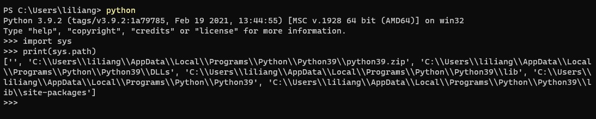

更多示例
==================

 pinpong库安装目录下有更多示例程序，可以通过如下方法找到.

1. 在终端输入python进入Python命令行，然后依次输入如下代码即可查看Python库所在的目录（site-packages）

.. code-block:: bash

    import sys
    print(sys.path)
    

2. 打开对应文件夹，在site-packages下有pinpong的文件夹，其中examples文件夹下即为所有内置的示例程序

.. 注意:: 内置examples文件夹下的案例仅供参考使用，不排除后续会变更，最终以本文档网页中列出的示例为准。

 