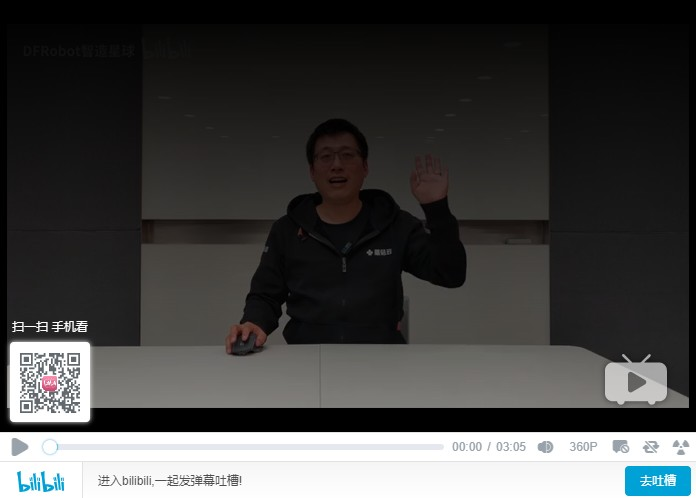

.. pinpong documentation master file, created by
   sphinx-quickstart on Fri May 22 22:20:20 2020.
   You can adapt this file completely to your liking, but it should at least
   contain the root `toctree` directive.

欢迎访问 pinpong python库教程文档!
===================================

pinpong库是一套控制开源硬件主控板的Python库，基于Firmata协议并兼容MicroPython语法，5分钟即可让你上手使用Python控制开源硬件。

借助于pinpong库，直接用Python代码就能给各种常见的开源硬件编程。其原理是给开源硬件烧录一个特定的固件，使开源硬件可以通过串口与电脑通讯，执行各种命令。

pinpong库的名称由“Pin”和“Pong”组成，“Pin”指引脚，“PinPong”为“乒乓球”的谐音，指信号的往复。

pinpong库的设计，是为了让开发者在开发过程中不用被繁杂的硬件型号束缚，而将重点转移到软件的实现。哪怕程序编写初期用Arduino开发，部署时改成了掌控板，只要修改一下硬件的参数就能正常运行，实现了“一次编写处处运行”。

.. 注意:: 当前PinPong库正在快速更新中，已支持Arduino系列uno、leonardo、mega2560,ESP32系列掌控板(handpy)，micro:bit(microbit)，行空板(unihiker)，传感器支持50+，其他主控板及更多扩展库将逐步支持。

本文档推荐阅读流程：

#. 查看安装教程进行准备
#. 查看示例快速上手测试
#. 查看教程进行系统学习

点击观看pinpong入门视频互动教程：https://www.bilibili.com/video/BV17K4y1T7MF

.. toctree::
   :maxdepth: 2
   :caption: pinpong介绍

   0.pinpong介绍/简介.rst
   1.pinpong教程/安装教程/index.rst

.. toctree::
   :maxdepth: 2
   :caption: pinpong示例

   2.pinpong示例/index1.rst
   2.pinpong示例/index2.rst
   2.pinpong示例/index3.rst
   2.pinpong示例/indexunihiker.rst
   2.pinpong示例/indexhandpy.rst
   2.pinpong示例/更多示例.rst

.. toctree::
   :maxdepth: 2
   :caption: pinpong教程

   1.pinpong教程/进阶教程/index.rst
   1.pinpong教程/高级教程/index.rst
   1.pinpong教程/经典案例/index.rst

.. toctree::
   :maxdepth: 2
   :caption: pinpong类库

   3.pinpong类库/API列表-Board类.rst
   3.pinpong类库/API列表-Pin类.rst
   3.pinpong类库/API列表-ADC类.rst
   3.pinpong类库/API列表-PWM类.rst

.. toctree::
   :maxdepth: 2
   :caption: pinpong更新记录

   4.pinpong更新记录/index.rst

.. toctree::
   :maxdepth: 2
   :caption: FAQ常见问题

   5.FAQ常见问题/index.rst

------------------

索引
==================

* :ref:`genindex`
* :ref:`modindex`
* :ref:`search`
